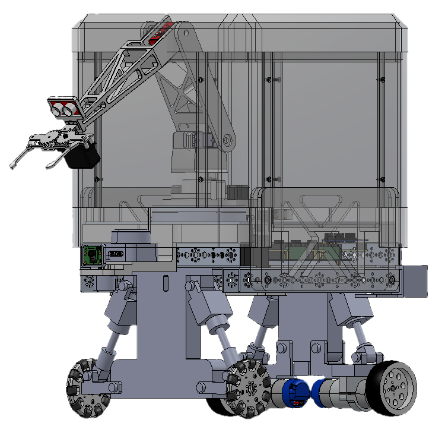
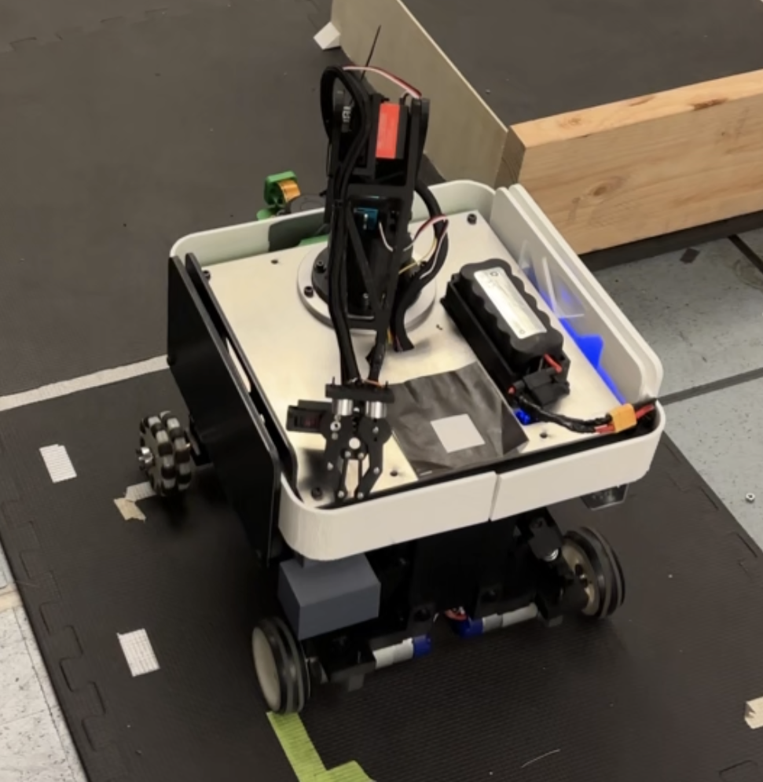
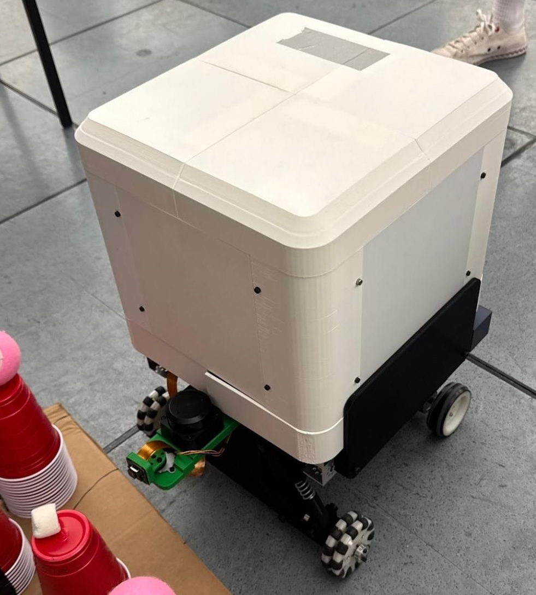
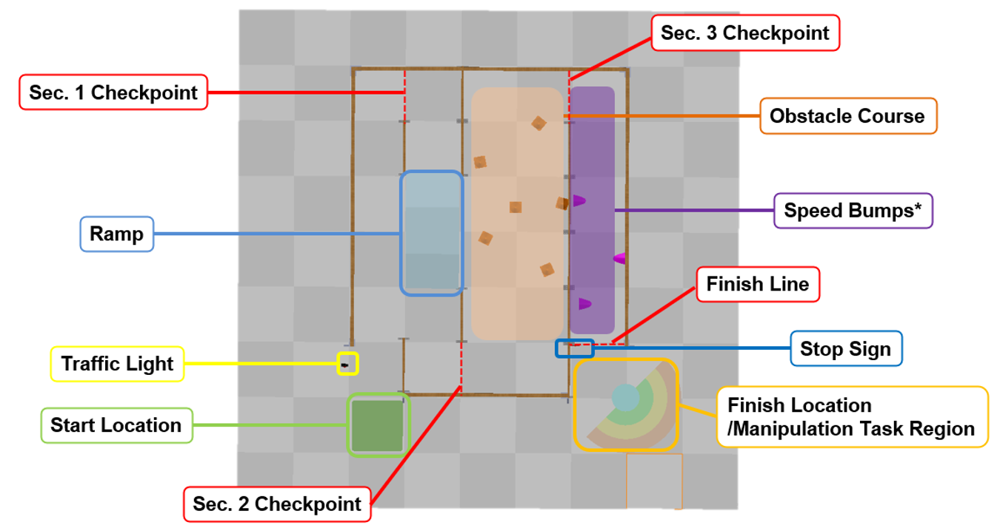
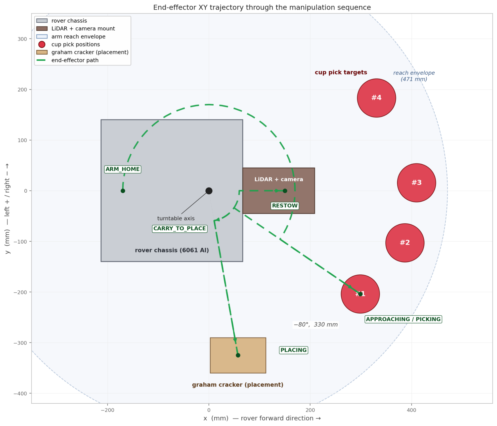
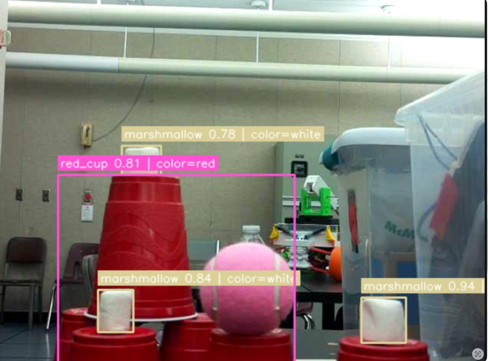
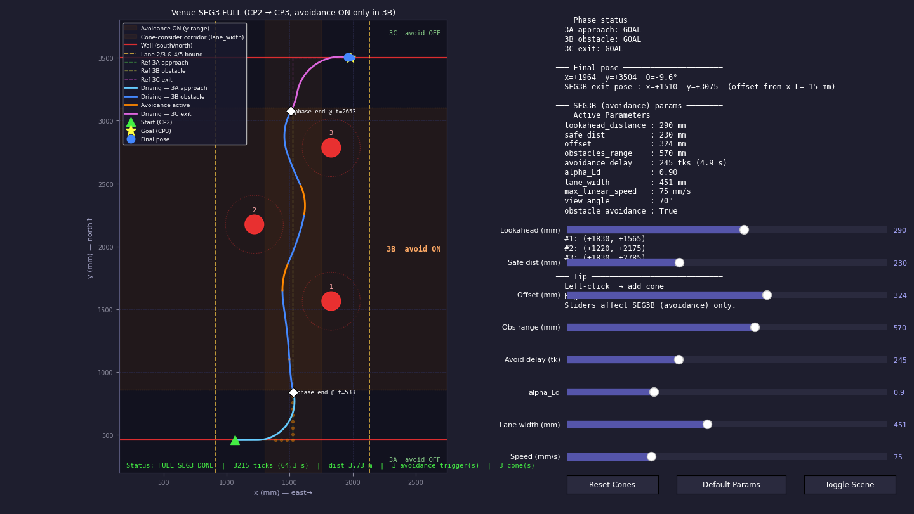

# MARSY

> **Mobile Autonomous Robotic SYstem**

| | | |
|---|---|---|
|  |  |  |
| Full assembly CAD | Operating configuration (driving and manipulation) | Protective enclosure installed for the drop and impact tests |

MARSY is an autonomous differential-drive mobile manipulator built for the MAE 162D/E capstone, on top of the course's shared NUEVO electronics and firmware base. It drives a multi-segment competition course with LiDAR obstacle avoidance, then uses vision-guided inverse kinematics to identify the marshmallow-bearing cup stack, pick from it, and place the marshmallow on a plate.

---

## Project Overview

The team's contribution is the physical robot and the high-level autonomy program. The teaching team supplied a shared base that all capstone teams build on: a custom PCB, the Arduino firmware that drives it, the TLV link to the Pi, and a ROS 2 node skeleton.

From a kit of four aluminum U-channel pieces, two driven wheels, two omni wheels, and DC motors with mounts, we designed and built the chassis, the suspension, and a 3-DOF manipulator around a purchased metal gripper.

On top of the provided software we wrote the manipulator program for vision-guided cup-stack selection, closed-form inverse kinematics, and the pick-and-place FSM. We brought up and calibrated every sensor and actuator on the robot, added our own ROS 2 nodes where the skeleton didn't cover what we needed (e.g., the ultrasonic ranger), tuned the drive PID against encoder feedback, and reworked the provided pure-pursuit follower and obstacle-avoidance planner for the venue course.

See it run: **TODO** add a YouTube link. Paste a URL on its own line (the capstone gallery embeds it):

```
https://www.youtube.com/watch?v=TODO
```

---

## Problem

Build a mobile manipulator that, with no operator intervention after a green-light go signal, can:

1. Navigate a multi-lane course at a competition venue, respecting lane geometry, an obstacle field, and a stop sign.
2. Park at a manipulation station and locate a single marshmallow that sits on one of four cup stacks of varying height.
3. Pick the marshmallow with a metal gripper, optionally roast it on a heating wire, and place it on a plate at a fixed offset.

Constraints:
- Hard real-time motor control on an Arduino Mega 2560, all higher logic on a Raspberry Pi 5.
- Communication between the two is a custom TLV protocol over a single UART link.
- A custom PCB integrates power delivery, motor drivers, and the Arduino footprint into a single board.
- No off-the-shelf navigation or manipulation stack. Perception, kinematics, and the demo FSM were written from scratch for this platform; pure-pursuit and the obstacle-avoidance planner were provided as starter code and reworked for the venue.

---

## Design and Approach

| Layer | Notes |
|---|---|
| **Mechanical** | Team-designed and team-built. Chassis, suspension, and a 3-DOF arm (turntable + shoulder + elbow) on a stepper-driven base, plus a camera-pan stepper, built from a starter kit (4 aluminum U-channels, 2 driven wheels, 2 omni wheels, DC motors + mounts), and a purchased metal gripper end effector. CAD in [`mechanical/`](mechanical/). A heating-wire roaster was designed and wired into the FSM but never installed mechanically (see Results). |
| **Custom PCB** | Provided by the teaching team. Arduino Mega 2560, dual DC motor drivers, stepper drivers, PCA9685 servo bus, LM61460 regulation. See [`nuevo_board/`](nuevo_board/). |
| **Arduino firmware** | Provided by the teaching team. Real-time motor PID, encoder odometry, stepper move queues, servo outputs, IMU + voltage monitoring, state-machine safety, and the TLV transport ([`firmware/`](firmware/), [`tlv_protocol/`](tlv_protocol/)). Drive PID gains were tuned by the team against the as-built drivetrain. |
| **Sensors** | Sensor selection was provided. The team mounted, wired, and calibrated the RPLIDAR C1, IMX477 camera, and Qwiic ultrasonic. The external GPS/ArUco localizer was built by the teaching team. The ICM-20948 IMU was dropped for the final demo due to magnetic interference from the electronics. |
| **ROS 2 stack** | Skeleton supplied (`bridge` TLV ⇆ ROS, `bridge_interfaces` msg/srv defs, `sensors`, `rplidar_ros`, `global_gps`, and the Robot API scaffolding inside `robot`). Team-added: ROS 2 nodes the skeleton didn't cover (e.g., the ultrasonic ranger), the `vision` package, and the high-level program inside the `robot` package consisting of FSMs, demo programs, manipulation code, and the perception/navigation integration that runs the demo ([`ros2_ws/src/`](ros2_ws/src/)). |
| **Perception** | Team-written. Detection for traffic lights, stop signs, marshmallows, and red cups, built on YOLO library pull-ins that the teaching team provided for the traffic-light and stop-sign detectors. |
| **Navigation** | Pure-pursuit follower and obstacle-avoidance scaffolding provided as starter code. Avoidance works by lane-switch waypoint regeneration: when a cone is detected, the planner inserts a hat-shaped detour (entry → hold past obstacle → return to center) into the remaining waypoint list. Team retuned both, added goal-y filtering so perimeter walls don't trigger detours, and wrote the four-segment venue FSM with a manual-reposition hold between segments. |
| **Manipulation** | Team-written. Closed-form 3-DOF inverse kinematics ([`arm_kinematics.py`](ros2_ws/src/robot/robot/arm_kinematics.py)) with explicit elbow-up branch selection; vision-driven stack selection; ultrasonic reach refinement; pick-and-place FSM. Documented in [`docs/manipulator.md`](docs/manipulator.md). |

### Software organization

The robot package follows a clean layout under `robot/programs/`:

```
robot/programs/
  demos/         the two headline programs
  navigation/    drive-only tests
  manipulation/  arm, servo, stepper, gripper, turntable, campan
  perception/    vision + lidar
  analysis/      data recording + plotting
  legacy/        archived earlier drafts
```

The two demo entry points are:
- [`full_competition_venue_run.py`](ros2_ws/src/robot/robot/programs/demos/full_competition_venue_run.py) for the full graded course
- [`precision_stack_manipulator_demo.py`](ros2_ws/src/robot/robot/programs/demos/precision_stack_manipulator_demo.py) for vision-driven pick-and-place

### Algorithms worth highlighting

- **Lane-switch waypoint-regeneration avoidance**: when a cone is detected, the planner inserts a hat-shaped detour into the remaining pure-pursuit path, with a goal-y filter that prevents the north wall from triggering detours.
- **Cup-pair vision detection** that confirms a marshmallow by matching its bearing against the nearest red-cup detection which is robust against tennis-ball decoys and false positives.
- **Closed-form IK with explicit branch selection**: the elbow can only fold one way, so we always select the "elbow up" branch deterministically.

---

## Results

The robot ran the venue course end-to-end and the manipulator ran the pick-and-place in isolation. The live demo had four visible issues that this section is honest about: the gripper would not release the marshmallow at the place pose, heading drift forced three manual repositions, the obstacle pass clipped one cone in the tight scenario, and odometry drift across a full venue run pushed the robot off the hardcoded cup positions, so the driving and the precision pick-and-place were demoed as separate programs. The platform itself (the team's mechanical build on top of the provided electronics and firmware) held up through the run.

### What worked

- **Full 4-segment venue navigation** including a U-turn, lane switch, and obstacle field
- **LiDAR lane-switch obstacle avoidance** (provided pure-pursuit avoidance planner, retuned for the venue) cleared 2 of 3 cones in the final run
- **Vision-guided stack selection** over the four hardcoded cup-stack positions: the vision selector reliably picks which stack contains the marshmallow when the robot starts from the known manipulation pose
- **Closed-form 3-DOF inverse kinematics** for both pick and place targets with deterministic elbow-up branch selection; the pick action ran end-to-end (place release did not; see below)
- **Localization**: the provided wheel-odometry + GPS/ArUco fusion kept the robot tracking the course (the ICM-20948 IMU was dropped for the final demo due to magnetic interference)
- **Stop-sign and traffic-light detection** in isolation during development
- **Protective enclosure passed both impact tests**: a basketball dropped onto the enclosure from 1 m and the robot itself dropped from 1 ft onto mats; the only damage was the press-fit top lid coming loose on impact, with no functional hardware harmed

### What didn't work in the live demo

- **Place-onto-plate release**: IK and FSM for the place pose were correct, and the gripper opened reliably at the pick pose, but would not open at the place pose. Most likely cause: the place reach extends the arm sideways with the gripper near-horizontal, gravity-loading the jaw closed against the MG996R's torque budget. A shoulder unload-lift (`UNLOAD_LIFT_DEG = 10°` in [`precision_stack_manipulator_demo.py`](ros2_ws/src/robot/robot/programs/demos/precision_stack_manipulator_demo.py)) wasn't enough to resolve it in the time we had.
- **Heading drift → three manual repositions**: the FSM intentionally pauses at segment boundaries (`MANUAL_REPOSITION_HOLD_S`) so the operator can re-place the robot at a known pose. We leaned on this hold rather than fighting drift autonomously.
- **Cone contact in the tight scenario**: the lane-switch avoidance cleared 2 of 3 cones but clipped one in the tight obstacle layout.
- **Stop-sign trigger didn't fire**: on the final run the robot drifted too far left of the lane center, and the stop sign sits on the far right of the lane, so the detector's range/bearing gate didn't trip. The detector usually works; we just didn't get enough end-to-end runs across the full demo to harden it, so the cause is essentially "robot was outside the gate region for this specific run." Code remains, gated by `STOP_SIGN_GATE_Y_MM` in [`full_competition_venue_run.py`](ros2_ws/src/robot/robot/programs/demos/full_competition_venue_run.py).
- **Integrated drive + pick (demos split)**: our first plan was to localize the marshmallow in free space with onboard sensors; that wasn't reliable, so we fell back to hardcoding the four candidate cup-stack positions and using vision only to pick among them. Even with the fallback, odometry drift after a full venue run left the robot off-pose relative to those hardcoded positions and the gripper would land in the wrong spot, so we ended up demoing the venue navigation and the precision pick-and-place as separate programs ([`full_competition_venue_run.py`](ros2_ws/src/robot/robot/programs/demos/full_competition_venue_run.py) and [`precision_stack_manipulator_demo.py`](ros2_ws/src/robot/robot/programs/demos/precision_stack_manipulator_demo.py)).

### What we cut

- **Heating-wire roast cycle**: software complete (the `PLACING → ROASTING` FSM transition and relay control path are wired in), but never installed in hardware. We couldn't find a safe way to mount an exposed heated element on a moving arm without unacceptable damage or burn risk, so the stage was cut by choice.

### Reference figures

| | |
|---|---|
|  |  |
| Annotated venue: start, segment checkpoints, ramp, obstacle course, traffic light, stop sign, finish line, and the manipulation task region. | Top-down view of the manipulation zone showing the rover footprint, LiDAR/camera mount, arm reach envelope, the four hardcoded cup-pick positions, the graham-cracker placement target, and a sample end-effector path. |
|  |  |
| Perception: YOLO detection with cup-pair color-coded confidences. The pink ball in frame is the tennis-ball decoy the cup-pair logic disambiguates against. | Obstacle-avoidance behavior simulator used to tune lane-switch parameters (lookahead, safe distance, lane offset, avoidance delay) against the cone field before each venue run. |

---

## How To Reproduce

### Hardware

Custom PCB and chassis as specified in [`nuevo_board/SPECIFICATIONS.md`](nuevo_board/SPECIFICATIONS.md) and [`mechanical/`](mechanical/). Build of materials and electrical references live in [`docs/`](docs/) (datasheets) and on the PCB schematic.

### One-time setup

Flash an Ubuntu 22.04 + ROS 2 Humble image to the Pi's SD card and put the Pi on the same WiFi as the workstation. Then:

```bash
git clone https://github.com/lozanoalexm10-droid/Project-NUEVO.git
cd Project-NUEVO

# Enable hardware UART, harden SysRq, install Docker + Compose, build the bridge frontend:
sudo bash ros2_ws/scripts/setup_rpi.sh

# Flash the Arduino firmware (see firmware/README.md)
```

### Run the full demo

Open four terminals on the Pi (the order matters: the robot node resets odometry on startup, so it must launch last):

| Terminal | Command |
|---|---|
| T1 | `docker compose -f ros2_ws/docker/docker-compose.rpi.yml up -d` |
| T2 | `ros2 launch robot everything_but_robot.launch.py` (LiDAR + GPS) |
| T3 | `ros2 launch vision vision_debug.launch.py` |
| T4 | `ros2 launch robot robot.launch.py` (always last) |

Select which program runs by uncommenting exactly one import in [`ros2_ws/src/robot/robot/main.py`](ros2_ws/src/robot/robot/main.py):

```python
from robot.programs.demos.full_competition_venue_run import run        # full course
#from robot.programs.demos.precision_stack_manipulator_demo import run # pick-and-place only
```

A `[FSM]` log on T4 traces every state transition during the run.

---

## Team Contributions

| Member | Contributions |
|---|---|
| **Todd Bell** | High-level autonomy software: manipulator program (inverse kinematics, vision-driven stack selection, pick-and-place FSM) and the venue-navigation FSM on top of the provided planners; belt-driven turntable subassembly design; simulation and parameter tuning for the obstacle-avoidance behavior and the manipulator workspace; sensor and actuator bring-up; electrical integration and motor/servo/stepper tuning; assembly, regular servicing, and demo testing |
| **Joanna Do** | Protective enclosure design and CAD; FEA impact analysis on the enclosure (drop-test load case); exploded-view documentation drawings; principal author of the team's final report; co-led project documentation throughout the build; assembly and regular servicing |
| **Lena Gudikunst** | Systems engineering and project administration; part procurement; suspension technical drawings and contributing CAD; co-led project documentation throughout the build; assembly and regular servicing |
| **Janice Hu** | Manipulator arm design and CAD; late-stage sensor mount design and integration; hardware verification to spec (reach, joint limits) and design iteration; primary lead on team mechanical assembly and regular servicing throughout the build |
| **Gerardo Lozano-Miranda** | Suspension CAD with multiple design iterations and stability analyses; sized the suspension across drop-survival cases that were stepped down over iterations from 1 m to 1 ft; differential-drive dynamics simulation; PID tuning via simulated open-loop → closed-loop transition; assembly and regular servicing |
| **William Tjandra** | Vision and detection work on the manipulator pipeline: HSV color filtering for marshmallow detection and a controlled matte-black workspace around the manipulation station to suppress false marshmallow detections from venue walls; soldering and electrical wiring; assembly and regular servicing |

---

## Links to More Detail

| Topic | Document |
|---|---|
| Cross-project docs index | [`docs/README.md`](docs/README.md) |
| Communication protocol | [`docs/COMMUNICATION_PROTOCOL.md`](docs/COMMUNICATION_PROTOCOL.md) |
| Design guidelines | [`docs/DESIGN_GUIDELINES.md`](docs/DESIGN_GUIDELINES.md) |
| Manipulator reference | [`docs/manipulator.md`](docs/manipulator.md) |
| Robot API reference | [`docs/robot_api_reference.md`](docs/robot_api_reference.md) |
| Firmware overview | [`firmware/README.md`](firmware/README.md) |
| PCB specifications | [`nuevo_board/SPECIFICATIONS.md`](nuevo_board/SPECIFICATIONS.md) |
| TLV payload layouts | [`tlv_protocol/TLV_Payloads.md`](tlv_protocol/TLV_Payloads.md) |
| Robot package README | [`ros2_ws/src/robot/README.md`](ros2_ws/src/robot/README.md) |
| Programs README | [`ros2_ws/src/robot/robot/programs/README.md`](ros2_ws/src/robot/robot/programs/README.md) |
| ROS 2 setup notes | [`docs/ros2/`](docs/ros2/) |

---

## Repository Map

```
firmware/        Arduino Mega 2560 firmware
nuevo_ui/        Raspberry Pi bridge + web UI
ros2_ws/         ROS 2 workspace
  src/
    bridge/              ROS ⇆ TLV firmware bridge
    bridge_interfaces/   custom msg/srv definitions
    sensors/             Pi-side sensor ROS nodes
    vision/              camera + perception nodes
    rplidar_ros/         RPLIDAR C1 driver
    global_gps/          GPS + ArUco ground-truth localizer
    robot/               high-level FSM, Robot API, planners, programs
tlv_protocol/    typed TLV definitions + code generators
nuevo_board/     PCB schematic, layout, BOM, datasheets
mechanical/      CAD for chassis and manipulator
docs/            cross-project documentation
assets/          branding
```
